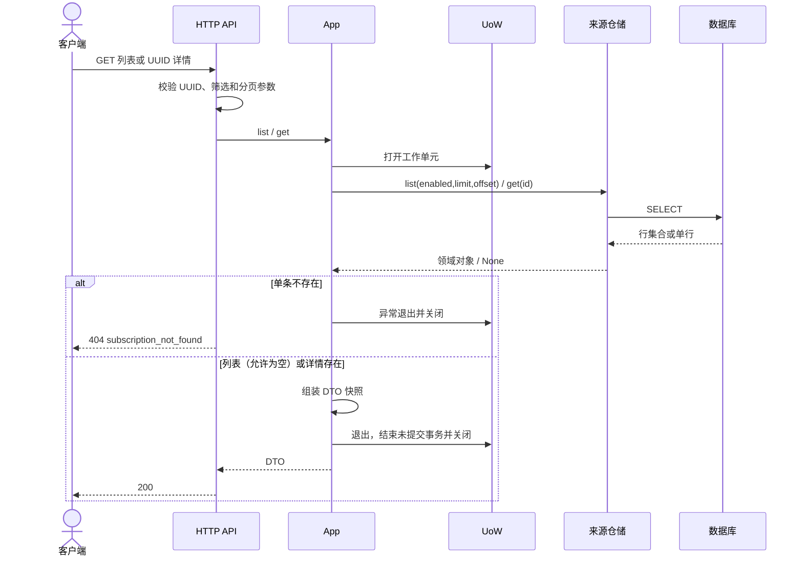

# SUB-002 来源查询

状态：已实现。列表和详情均不触发抓取。

```mermaid
sequenceDiagram
    actor C as 客户端
    participant H as HTTP API
    participant A as App
    participant U as UoW
    participant R as 来源仓储
    participant DB as 数据库
    C->>H: GET 列表或 UUID 详情
    H->>H: 校验 UUID、筛选和分页参数
    H->>A: list / get
    A->>U: 打开工作单元
    A->>R: list(enabled,limit,offset) / get(id)
    R->>DB: SELECT
    DB-->>R: 行集合或单行
    R-->>A: 领域对象 / None
    alt 单条不存在
        A->>U: 异常退出并关闭
        H-->>C: 404 subscription_not_found
    else 列表（允许为空）或详情存在
        A->>A: 组装 DTO 快照
        A->>U: 退出，结束未提交事务并关闭
        A-->>H: DTO
        H-->>C: 200
    end
```

参数非法返回 422，不进入查询。列表稳定按 created_at、id 升序；offset 分页不承诺并发插入期间的快照一致性。
