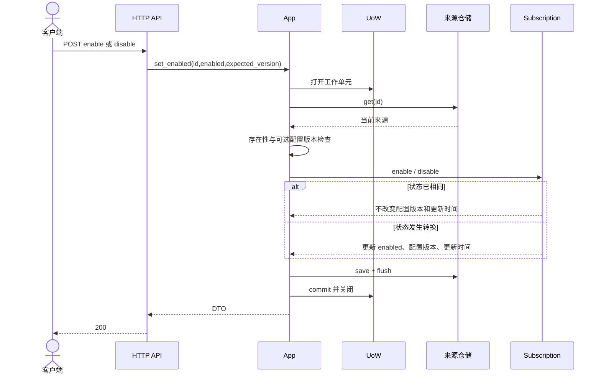

# SUB-004 启用与关闭

状态：已实现。启用与关闭共用 set_enabled 用例。

```mermaid
sequenceDiagram
    actor C as 客户端
    participant H as HTTP API
    participant A as App
    participant U as UoW
    participant R as 来源仓储
    participant D as Subscription
    C->>H: POST enable 或 disable
    H->>A: set_enabled(id,enabled,expected_version)
    A->>U: 打开工作单元
    A->>R: get(id)
    R-->>A: 当前来源
    A->>A: 存在性与可选配置版本检查
    A->>D: enable / disable
    alt 状态已相同
        D-->>A: 不改变配置版本和更新时间
    else 状态发生转换
        D-->>A: 更新 enabled、配置版本、更新时间
    end
    A->>R: save + flush
    A->>U: commit 并关闭
    A-->>H: DTO
    H-->>C: 200
```

来源不存在返回 404，过期客户端版本或实际更新的乐观锁冲突返回 409，异常退出回滚。
即使操作目标与当前状态相同，也先检查显式提供的客户端版本。
无状态变化时 ORM 可能不发 UPDATE，因此不能把幂等请求视为数据库锁操作。
流程不发送任务、不取消运行、不清理历史条目。
