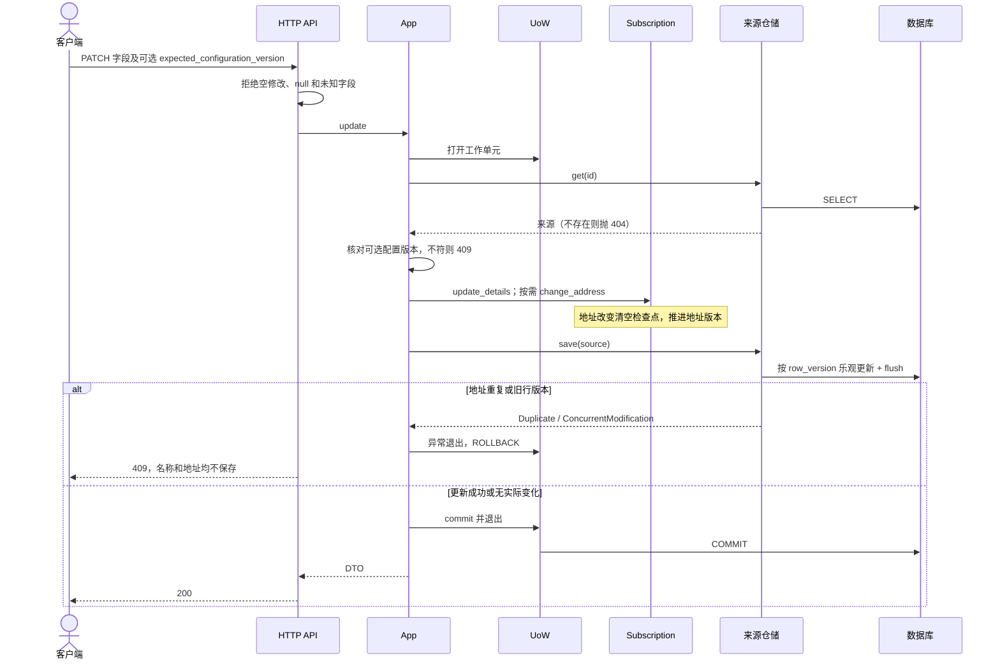

# SUB-003 修改来源与冲突处理

状态：已实现。详情字段和地址同事务更新。

```mermaid
sequenceDiagram
    actor C as 客户端
    participant H as HTTP API
    participant A as App
    participant U as UoW
    participant D as Subscription
    participant R as 来源仓储
    participant DB as 数据库
    C->>H: PATCH 字段及可选 expected_configuration_version
    H->>H: 拒绝空修改、null 和未知字段
    H->>A: update
    A->>U: 打开工作单元
    A->>R: get(id)
    R->>DB: SELECT
    R-->>A: 来源（不存在则抛 404）
    A->>A: 核对可选配置版本，不符则 409
    A->>D: update_details；按需 change_address
    Note over D: 地址改变清空检查点，推进地址版本
    A->>R: save(source)
    R->>DB: 按 row_version 乐观更新 + flush
    alt 地址重复或旧行版本
        R-->>A: Duplicate / ConcurrentModification
        A->>U: 异常退出，ROLLBACK
        H-->>C: 409，名称和地址均不保存
    else 更新成功或无实际变化
        A->>U: commit 并退出
        U->>DB: COMMIT
        A-->>H: DTO
        H-->>C: 200
    end
```

404、配置版本冲突或领域参数非法会提前结束流程，退出工作单元，无后续 save/commit。
真实变化的配置版本才推进；名称/分类与地址分别变化时可能推进两次。
客户端配置版本检查不能替代数据库乐观锁；冲突后应重新读取并判断，不盲目重放旧对象。
